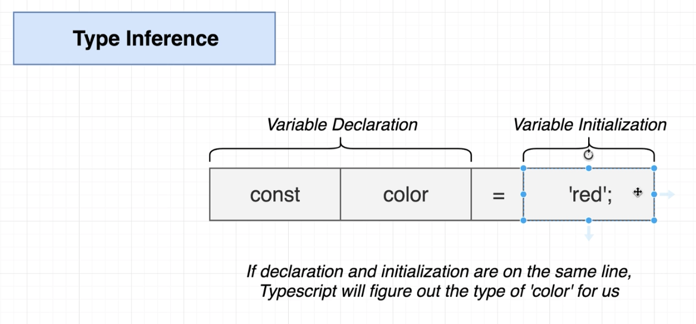
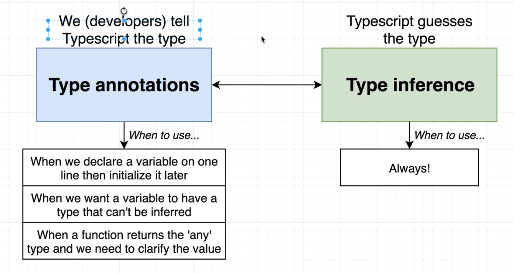

<div align = "center">
  
</div>

<hr>

## Table of Contents

- [What is TypeScript?](#what-is-typescript)
- [Why do we care about types?](#why-do-we-care-about-types)
- [Why should I use TypeScript](#why-should-i-use-typescript)
- [TypeScript Simple Types](#typescript-simple-types)
- [Type Assignment](#type-assignment)
- [TypeScript Special Types](#typesctip-special-types)
- [TypeScript Arrays](#typescript-array)
- [TypeScript Tuples](#typescript-tuples)
- [TypeScript Object Types](#typescript-object-types)
- [TypeScript Enums](#typescript-enums)
- [TypeScript Type Aliases and Interfaces](#typescript-type-aliases-and-interfaces)
- [TypeScript Union Types](#typescript-union-types)
- [TypeScript Functions](#typescript-functions)

# What is TypeScript?

TypeScript is a free and open-source programming language developed and maintained by Microsoft. It is a strict syntactical superset of JavaScript, which means that TypeScript adds syntax on top of it, allowing developers to work with the type system it provides.

A common way to use TypeScript is to use the official TypeScript compiler, which compiles TypeScript to readable, standards-based JavaScript.

# Why do we care about types?

1. Types are used by the TypeScript Compiler to analyze our code for errors.
2. Types allow other engineers to understand what values are flowing around our codebase.

# Why should I use TypeScript?

JavaScript is a loosely typed language. It can be difficult to understand what types of data are being passed around in JavaScript.

Due to this downside of JavaScript, TypeScript:

1. Simplifies JavaScript code, making it easier to read, understand, maintain and debug.
2. Uses compile time type checking. Which means it checks if the specified types match **before** running the code, not **while** running the code.
3. It helps in code structuring.
4. Adds type support to JavaScript. The type system of TypeScript is relatively rich and includes: interfaces, enums, hybrid types, generics, union and intersection types, access modifiers and much more. TypeScript makes typing a bit easier and a lot less explicit by the usage of type inference.
5. TypeScript supports new ECMAScript standards and compiles them to (older) ECMAScript targets of your choosing. This means that you can use features of ES2015 and beyond, like modules, lambda functions, classes, the spread operator, destructuring, today.

# TypeScript Simple Types

TypeScript supports some simple types (primitives) you may know.

There are three main primitives in JavaScript and TypeScript.

    boolean - true or false values
    number - whole numbers and floating point values
    string - text values like "TypeScript Rocks"

# Type Assignment

When creating a variable, there are two main ways TypeScript assigns a type: Explicit or Implicit,

In both examples below `firstName` is of type `string`.

## Explict Type or Type Annotation

**Explicit** - Code we add to tell TypeScript what type of value a variable will refer to. They are easier to read and more intentional.

```TypeScript
 let firstName: string = "Dylan";
```

## Implicit Type or Type Inference

**Implicit** - TypeScript tries to figure out what type of value a variable refers to.

<div aign="center">
  
</div>

```TypeScript
 let firstName = "Dylan";
```

## Unable to Infer

TypeScript may not always properly infer what the type of a variable may be. In such cases, it will set the type to `any` which disables type checking.

```TypeScript
// Implicit any as JSON.parse doesn't know what type of data it returns so it can be "any" thing...
const json = JSON.parse("55");
// Most expect json to be an object, but it can be a string or a number like this example
console.log(typeof json);
```

This behavior can be disabled by enabling `noImplicitAny` as an option in a TypeScript's project `tsconfig.json`. That is a JSON config file for customizing how some of TypeScript behaves.

So, when are we going to add in Type Annotations? When are we going to type them out? if we're saying that TypeScript can figure out these different types for us, why would we go through the process of writting out the annotations manually?

<div aign="center">
  
</div>

<br />

# TypeScript Special Types

TypeScript has special types that may not refer to any specific type of data.

## Type: any

`any` is a type that disables type checking and effectively allows all types to be used.

The example below does not use `any` and will throw an error:

```TypeScript
let u = true;
u = "string"; // Error: Type 'string' is not assignable to type 'boolean'.
Math.round(u); // Error: Argument of type 'boolean' is not assignable to parameter of type 'number'.
```

Setting `any` to the special type `any` disables type checking:

```TypeScript
let v: any = true;
v = "string"; // no error as it can be "any" type
Math.round(v); // no error as it can be "any" type
```

_**IMPORTANT**: any can be a useful way to get past errors since it disables type checking, but TypeScript will not be able provide type safety, and tools which rely on type data, such as auto completion, will not work. Remember, it should be avoided at "any" cost._

## Type: unknown

`unknown` is a similar, but safer alternative to `any`.

TypeScript will prevent `unknown` types from being used, as shown in the below example:

```TypeScript
let w: unknown = 1;
w = "string"; // no error
w = {
  runANonExistentMethod: () => {
    console.log("I think therefore I am");
  }
} as { runANonExistentMethod: () => void}
// How can we avoid the error for the code commented out below when we don't know the type?
// w.runANonExistentMethod(); // Error: Object is of type 'unknown'.
if(typeof w === 'object' && w !== null) {
  (w as { runANonExistentMethod: Function }).runANonExistentMethod();
}
// Although we have to cast multiple times we can do a check in the if to secure our type and have a safer casting
```

Compare the example above to the previous example, with `any`.

_IMPORTANT: unknown is best used when you don't know the type of data being typed. To add a type later, you'll need to cast it. Casting is when we use the "as" keyword to say property or variable is of the casted type._

## Type: never

`never` effectively throws an error whenever it is defined.

```TypeScript
let x: never = true; // Error: Type 'boolean' is not assignable to type 'never'.
```

_IMPORTANT: never is rarely used, especially by itself, its primary use is in advanced generics._

## Type: undefined & null

`undefined` and `null` are types that refer to the JavaScript primitives `undefined` and `null` respectively.

```TypeScript
let y: undefined = undefined;
let z: null = null;
```

_IMPORTANT: These types don't have much use unless strictNullChecks is enabled in the tsconfig.json file._

<br />

# TypeScript Arrays

TypeScript has a specific syntax for typing arrays.

```TypeScript
const names: string[] = [];
names.push("Dylan"); // no error
// names.push(3); // Error: Argument of type 'number' is not assignable to parameter of type 'string'.
```

## Readonly

The `readonly` keyword can prevent arrays from being changed.

```TypeScript
const names: readonly string[] = ["Dylan"];
names.push("Jack"); // Error: Property 'push' does not exist on type 'readonly string[]'.
// try removing the readonly modifier and see if it works?
```

## Type Inference

TypeScript can infer the type of an array if it has values.

```TypeScript
const numbers = [1, 2, 3]; // inferred to type number[]
numbers.push(4); // no error
// comment line below out to see the successful assignment
numbers.push("2"); // Error: Argument of type 'string' is not assignable to parameter of type 'number'.
let head: number = numbers[0]; // no error
```

# TypeScript Tuples

A **tuple** is a typed array with a pre-defined length and types for each index.

Tuples are great because they allow each element in the array to be a known type of value.

To define a tuple, specify the type of each element in the array:

```TypeScript
// define our tuple
let ourTuple: [number, boolean, string];

// initialize correctly
ourTuple = [5, false, 'Coding God was here'];
```

As you can see we have a number, boolean and a string. But what happens if we try to set them in the wrong order:

```TypeScript
// define our tuple
let ourTuple: [number, boolean, string];

// initialize incorrectly throws an error
ourTuple = [false, 'Coding God was mistaken', 5];
```

_IMPORTANT: Even though we have a `boolean`, `string`, and `number` the order matters in our tuple and will throw an error._

## Readonly Tuple

A good practice is to make your **tuple** `readonly`.

Tuples only have strongly defined types for the initial values:

```TypeScript
// define our tuple
let ourTuple: [number, boolean, string];
// initialize correctly
ourTuple = [5, false, 'Coding God was here'];
// We have no type safety in our tuple for indexes 3+
ourTuple.push('Something new and wrong');
console.log(ourTuple);
```

You see the new valueTuples only have strongly defined types for the initial values:

```TypeScript
// define our readonly tuple
const ourReadonlyTuple: readonly [number, boolean, string] = [5, true, 'The Real Coding God'];
// throws error as it is readonly.
ourReadonlyTuple.push('Coding God took a day off');
```

```Text
IMPORTANT:  If you have ever used React before you have worked with tuples more than likely. `useState` returns a tuple of the value and a setter function.

const [firstName, setFirstName] = useState('Dylan') is a common example.

Because of the structure we know our first value in our list will be a certain value type in this case a string and the second value a function.
```

# TypeScript Object Types

TypeScript has a specific syntax for typing objects.

```TypeScript
const car: { type: string, model: string, year: number } = {
  type: "Toyota",
  model: "Corolla",
  year: 2009
};
```

## Type Inference

TypeScript can infer the types of properties based on their values.

```TypeScript
const car = {
  type: "Toyota",
};
car.type = "Ford"; // no error
car.type = 2; // Error: Type 'number' is not assignable to type 'string'.
```

## Optional Properties

Object properties are properties that don't have to be defined in the object definition.

_Example without an optional property_

```TypeScript
const car: { type: string, mileage: number } = { // Error: Property 'mileage' is missing in type '{ type: string; }' but required in type '{ type: string; mileage: number; }'.
  type: "Toyota",
};
car.mileage = 2000;
```

_Example with an optional property_

```TypeScript
const car: { type: string, mileage?: number } = { // no error
  type: "Toyota"
};
car.mileage = 2000;
```

## Index Signatures

Index signatures can be used for objects without a defined list of properties.

```TypeScript
const nameAgeMap: { [index: string]: number } = {};
nameAgeMap.Jack = 25; // no error
nameAgeMap.Mark = "Fifty"; // Error: Type 'string' is not assignable to type 'number'.
```

_IMPORTANT: Index signatures like this one can also be expressed with utility types like Record<string, number>._

# TypeScript Enums

An **enum** is a special "class" that represents a group of constants (unchangeable variables).

Enums come in two flavors `string` and `numeric`. Lets start with numeric.

## Numeric Enums - Default

By default, enums will initialize the first value to `0` and add 1 to each additional value:

```TypeScript
enum CardinalDirections {
  North,
  East,
  South,
  West
}
let currentDirection = CardinalDirections.North;
// logs 0
console.log(currentDirection);
// throws error as 'North' is not a valid enum
currentDirection = 'North'; // Error: "North" is not assignable to type 'CardinalDirections'.
```

## Numeric Enums - Initialized

You can set the value of the first numeric enum and have it auto increment from that:

```TypeScript
enum CardinalDirections {
  North = 1,
  East,
  South,
  West
}
// logs 1
console.log(CardinalDirections.North);
// logs 4
console.log(CardinalDirections.West);
```

## Numeric Enums - Fully Initialized

You can assign unique number values for each enum value. Then the values will not incremented automatically:

```TypeScript
enum StatusCodes {
  NotFound = 404,
  Success = 200,
  Accepted = 202,
  BadRequest = 400
}
// logs 404
console.log(StatusCodes.NotFound);
// logs 200
console.log(StatusCodes.Success);
```

## String Enums

Enums can also contain `strings`. This is more common than numeric enums, because of their readability and intent.

```TypeScript
enum CardinalDirections {
  North = 'North',
  East = "East",
  South = "South",
  West = "West"
};
// logs "North"
console.log(CardinalDirections.North);
// logs "West"
console.log(CardinalDirections.West);
```

# TypeScript Type Aliases and Interfaces

TypeScript allows types to be defined separately from the variables that use them.

Aliases and Interfaces allows types to be easily shared between different variables/objects.

## Type Aliases

Type Aliases allow defining types with a custom name (an Alias).

Type Aliases can be used for primitives like string or more complex types such as `objects` and `arrays`:

```TypeScript
type CarYear = number
type CarType = string
type CarModel = string
type Car = {
  year: CarYear,
  type: CarType,
  model: CarModel
}

const carYear: CarYear = 2001
const carType: CarType = "Toyota"
const carModel: CarModel = "Corolla"
const car: Car = {
  year: carYear,
  type: carType,
  model: carModel
};
```

## Interfaces

Interfaces are similar to type aliases, except they **only** apply to `object` types.

```TypeScript
interface Rectangle {
  height: number,
  width: number
}

const rectangle: Rectangle = {
  height: 20,
  width: 10
};
```

## Extending Interfaces

Interfaces can extend each other's definition.

**Extending** an interface means you are creating a new interface with the same properties as the original, plus something new.

```TypeScript
interface Rectangle {
  height: number,
  width: number
}

interface ColoredRectangle extends Rectangle {
  color: string
}

const coloredRectangle: ColoredRectangle = {
  height: 20,
  width: 10,
  color: "red"
};
```

# TypeScript Union Types

**Union types **are used when a value can be more than a single type.

Such as when a property would be `string` or `number`.

## Union | (OR)

Using the `|` we are saying our parameter is a `string` or `number`:

```TypeScript
function printStatusCode(code: string | number) {
  console.log(`My status code is ${code}.`)
}
printStatusCode(404);
printStatusCode('404');
```

## Union Type Errors

**Note:** you need to know what your type is when union types are being used to avoid type errors:

```TypeScript
function printStatusCode(code: string | number) {
  console.log(`My status code is ${code.toUpperCase()}.`) // error: Property 'toUpperCase' does not exist ontype 'string | number'.
  Property 'toUpperCase' does not exist on type 'number'
}
```

# TypeScript Functions

TypeScript has a specific syntax for typing function parameters and return values.

## Return Type

The type of the value returned by the function can be explicitly defined.

```TypeScript
// the `: number` here specifies that this function returns a number
function getTime(): number {
  return new Date().getTime();
}
```

If no return type is defined, TypeScript will attempt to infer it through the types of the variables or expressions returned.

## Void Return Type

The type `void` can be used to indicate a function doesn't return any value.

```TypeScript
function printHello(): void {
  console.log('Hello!');
}
```

## Parameters

Function parameters are typed with a similar syntax as variable declarations.

```TypeScript
function multiply(a: number, b: number) {
  return a * b;
}
```

If no parameter type is defined, TypeScript will default to using `any`, unless additional type information is available as shown in the Default Parameters and Type Alias sections below.

## Optional Parameters

By default TypeScript will assume all parameters are required, but they can be explicitly marked as optional.

```TypeScript
// the `?` operator here marks parameter `c` as optional
function add(a: number, b: number, c?: number) {
  return a + b + (c || 0);
}
```

## Default Parameters

For parameters with default values, the default value goes after the type annotation:

```TypeScript
function pow(value: number, exponent: number = 10) {
  return value ** exponent;
}
```

TypeScript can also infer the type from the default value.

## Named Parameters

Typing named parameters follows the same pattern as typing normal parameters.

```TypeScript
function divide({ dividend, divisor }: { dividend: number, divisor: number }) {
  return dividend / divisor;
}
```

## Rest Parameters

Rest parameters can be typed like normal parameters, but the type must be an array as rest parameters are always arrays.

```TypeScript
function add(a: number, b: number, ...rest: number[]) {
  return a + b + rest.reduce((p, c) => p + c, 0);
}
```

## Type Alias

Function types can be specified separately from functions with type aliases.

``TypeScript
type Negate = (value: number) => number;

// in this function, the parameter `value` automatically gets assigned the type `number` from the type `Negate`
const negateFunction: Negate = (value) => value \* -1;

```

```
